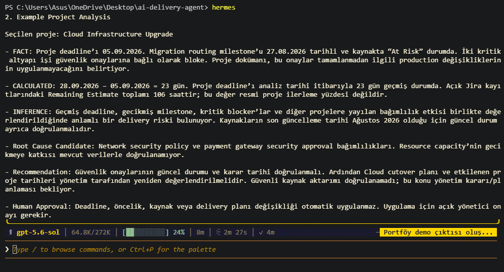

# AI Delivery Agent — Demo

[English](#english) | [Türkçe](#türkçe)

This demo presents a sample output generated by the AI Delivery Agent using the synthetic eight-project portfolio included in this repository.

> All data shown in this demo is synthetic. No live enterprise systems are connected.

---

# English

## Portfolio Executive Summary

**Analysis Date:** 28.09.2026

| Project | Overall Status | Critical Point / Date | Short Note |
|---|---|---|---|
| Payment API Modernization | Blocked | Go-live: 30.09.2026 | Production infrastructure and security validation are blocked. |
| Mobile Checkout Revamp | At Risk | Go-live target: 25.09.2026 — passed | Payment API dependency and an open Android issue affect integration and testing. |
| Customer Self-Service Portal | Requires Attention | Go-live: 15.10.2026 | No open blocker identified; current completion status of the profile update milestone requires verification. |
| AI Recommendation Engine | At Risk | Go-live: 10.10.2026 | Feature pipeline and data schema work are blocked. |
| Data Platform Migration | At Risk | Go-live target: 20.09.2026 — passed | Critical feature-table migration is blocked; validation and cutover work remain. |
| Cloud Infrastructure Upgrade | Blocked | Go-live target: 05.09.2026 — passed | Critical routing and payment gateway work depend on security approvals and affect multiple projects. |
| Identity & Access Security Upgrade | At Risk | Go-live target: 15.09.2026 — passed | Network security policy approval is blocked and affects Cloud cutover and dependent projects. |
| CRM Integration Program | At Risk | Go-live: 05.10.2026 | Test environment and order synchronization work are blocked by Cloud dependencies; E2E regression has not started. |

---

## Example Project Analysis

**Selected Project:** Cloud Infrastructure Upgrade

**FACT**  
The project deadline is 05.09.2026. The Migration Cutover Routing milestone is dated 27.08.2026 and has an **At Risk** status. Critical infrastructure activities depend on security approvals. The project documentation states that related production changes should not be applied before these approvals are completed.

**CALCULATED**  
As of 28.09.2026, the project deadline has passed by **23 days**. Open Jira items have a combined Remaining Estimate of **106 hours**; this value is not treated as an official project progress percentage.

**INFERENCE**  
The passed deadline, delayed milestone, critical blockers, and dependency impact across other projects together indicate meaningful delivery risk. Because the latest source updates are from August 2026, the current situation should also be verified.

**Root Cause Candidate**  
Network security policy and payment gateway security approval dependencies. The available data does not confirm that resource capacity caused the delay.

**Recommendation**  
Verify the current status and decision dates of the security approvals. Then reassess the Cloud cutover plan and affected project dates. A safe resource reassignment cannot be confirmed from the available evidence.

**Human Approval**  
Changes to deadlines, priorities, resources, or the delivery plan must not be applied automatically. Explicit management approval is required.

---

## Actual Agent Output

The analysis above was generated by the AI Delivery Agent in Hermes using the synthetic project data and the Agent's decision policy.

---

# Türkçe

## Portföy Yönetici Özeti

**Analiz Tarihi:** 28.09.2026

| Proje | Genel Durum | Kritik Nokta / Tarih | Kısa Not |
|---|---|---|---|
| Payment API Modernization | Bloke | Canlı geçiş: 30.09.2026 | Production altyapısı ve güvenlik doğrulaması bloke. |
| Mobile Checkout Revamp | Riskli | Canlı geçiş hedefi: 25.09.2026 — geçti | Payment API bağımlılığı ve açık Android hatası entegrasyon ve test takvimini etkiliyor. |
| Customer Self-Service Portal | Takip Gerekiyor | Canlı geçiş: 15.10.2026 | Açık blocker bulunmuyor; profil güncelleme milestone'unun güncel tamamlanma durumu doğrulanmalı. |
| AI Recommendation Engine | Riskli | Canlı geçiş: 10.10.2026 | Feature pipeline ve veri şeması işleri bloke. |
| Data Platform Migration | Riskli | Canlı geçiş hedefi: 20.09.2026 — geçti | Kritik feature table migration işi bloke; validation ve cutover işleri bulunuyor. |
| Cloud Infrastructure Upgrade | Bloke | Canlı geçiş hedefi: 05.09.2026 — geçti | Kritik routing ve payment gateway işleri güvenlik onaylarına bağlı; birden fazla proje etkileniyor. |
| Identity & Access Security Upgrade | Riskli | Canlı geçiş hedefi: 15.09.2026 — geçti | Network security policy onayı bloke; Cloud cutover ve bağlantılı projeler etkileniyor. |
| CRM Integration Program | Riskli | Canlı geçiş: 05.10.2026 | Test ortamı ve order synchronization işleri Cloud bağımlılıkları nedeniyle bloke; E2E regression henüz başlamamış görünüyor. |

---

## Örnek Proje Analizi

**Seçilen Proje:** Cloud Infrastructure Upgrade

**FACT**  
Proje deadline'ı 05.09.2026. Migration Cutover Routing milestone'u 27.08.2026 tarihli ve **At Risk** durumunda. Kritik altyapı işleri güvenlik onaylarına bağlı. Proje dokümanı, bu onaylar tamamlanmadan ilgili production değişikliklerinin uygulanmaması gerektiğini belirtiyor.

**CALCULATED**  
28.09.2026 itibarıyla proje deadline'ı **23 gün geçmiş** durumda. Açık Jira kayıtlarındaki Remaining Estimate toplamı **106 saat**; bu değer resmi proje ilerleme yüzdesi değildir.

**INFERENCE**  
Geçmiş deadline, gecikmiş milestone, kritik blocker'lar ve diğer projelere yayılan dependency etkisi birlikte değerlendirildiğinde anlamlı bir delivery riski bulunuyor. Kaynakların son güncelleme tarihleri Ağustos 2026 olduğu için güncel durum ayrıca doğrulanmalı.

**Root Cause Candidate**  
Network security policy ve payment gateway security approval bağımlılıkları. Resource capacity'nin gecikmeye katkısı mevcut verilerle doğrulanamıyor.

**Recommendation**  
Güvenlik onaylarının güncel durumu ve karar tarihi doğrulanmalı. Ardından Cloud cutover planı ve etkilenen proje tarihleri yeniden değerlendirilmeli. Mevcut kanıtlarla güvenli bir resource reassignment doğrulanamıyor.

**Human Approval**  
Deadline, öncelik, kaynak veya delivery planı değişiklikleri otomatik uygulanmamalı. Uygulama için açık yönetici onayı gereklidir.

---

## Gerçek Agent Çıktısı

## Gerçek Agent Çıktısı

Yukarıdaki analiz AI Delivery Agent tarafından Hermes üzerinde, sentetik proje verileri ve Agent'ın karar politikası kullanılarak üretilmiştir.

---

## Demo Scope

This demo demonstrates the prototype's decision-support behavior. It does not represent a production deployment or a live connection to Jira, Confluence, HR, financial, or other enterprise systems.

**AI supports the decision. Human accountability remains with the manager.**

**AI kararı destekler. Nihai sorumluluk yöneticide kalır.**
